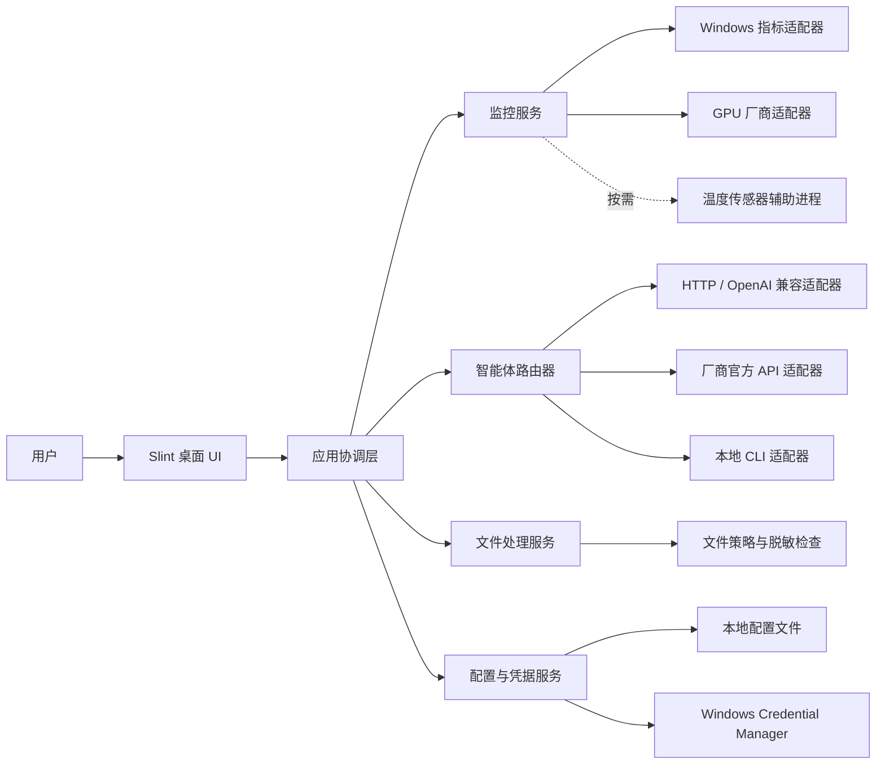
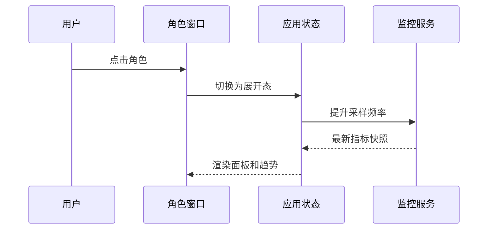
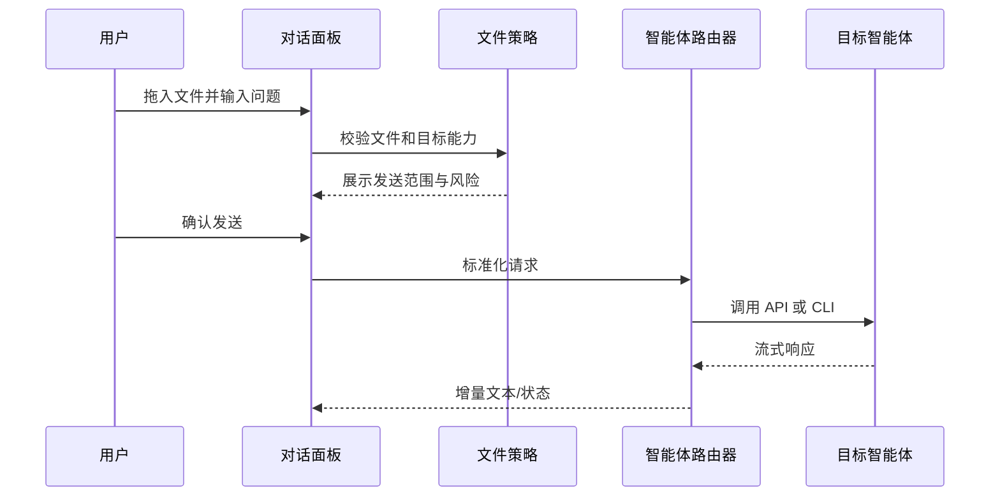

# 桌面智能助手总体开发方案

> 版本：v0.1（方案基线）
> 日期：2026-07-30
> 首期平台：Windows 10/11 x64
> 核心目标：低资源常驻的桌面硬件监控入口与多智能体统一交互入口

## 1. 产品定位

这是一个长期驻留桌面的轻量助手。收起时仅显示用户选择的角色形象；点击后原位展开监控面板、智能体选择器和问题输入区。用户可以拖动它、设置窗口置顶、拖入文件，并把问题或文件交给已配置的智能体。

首期不把它做成完整聊天客户端或自动化平台，而是优先解决三个高频场景：

1. 不打开任务管理器即可查看 CPU、内存、显存、温度和网络速率。
2. 用一个统一入口调用本地或云端智能体。
3. 将桌面文件直接交给智能体处理，并明确告知文件会被发送到哪里。

## 2. 范围与边界

### 2.1 MVP 必须具备

- 透明、无边框、可拖动的桌面角色窗口。
- 置顶开关、锁定位置、开机启动、最小化到托盘。
- 收起/展开两种状态，保存每台显示器上的位置和缩放比例。
- CPU 总占用、内存占用、显存占用、GPU 利用率、可用温度、网络上/下行速率。
- 指标当前值、短时趋势图、采样频率设置和阈值提醒。
- 智能体配置、切换、文本提问、流式回答、停止生成、错误重试。
- 文件拖放、待发送文件列表、大小与类型检查、发送前确认。
- 首批连接方式：OpenAI 兼容 API、官方 HTTP API、本地 CLI。
- 首批预置模板：Codex、千问、豆包、DeepSeek；Hermes、WorkBuddy 通过兼容 API 或本地 CLI 模板接入。
- API Key 使用 Windows Credential Manager 保存，配置文件中只保留凭据引用。

### 2.2 MVP 明确不做

- 不承诺首版覆盖所有主板、CPU 和显卡的温度传感器。
- 不做未经用户确认的后台文件上传、屏幕录制或全盘索引。
- 不做开放的第三方二进制插件市场。
- 不做复杂工作流编排、多智能体协作、长期记忆和云同步。
- 不在首期支持 macOS/Linux；核心模块保留跨平台边界，后续另行适配。

## 3. 关键假设和成功标准

### 3.1 当前假设

- 目标用户以 Windows 个人电脑用户为主，单机、单用户运行。
- 允许安装一个桌面应用；温度兼容包可作为可选组件安装。
- 智能体必须存在官方 API、OpenAI 兼容接口、本地 CLI 或可调用的本地服务，才能稳定接入。仅能通过网页使用的产品不在稳定支持范围内。
- “任意智能体”通过统一适配协议逐步扩展，而不是对所有品牌做网页自动化。

### 3.2 非功能目标

| 类别 | MVP 目标 |
|---|---|
| 空闲 CPU | 角色收起时平均不高于 0.5%，P95 不高于 1% |
| 内存 | 核心程序收起不高于 50 MB，展开不高于 80 MB；可选传感器进程另计但总量目标不高于 120 MB |
| 启动 | 普通 SSD 冷启动到角色可见不高于 1.5 秒 |
| 交互 | 点击展开反馈不高于 100 ms；面板完整显示不高于 300 ms |
| 采样 | 默认 1 秒刷新一次；收起时可降为 2-5 秒 |
| 稳定性 | 连续运行 7 天无明显内存增长，网络/智能体故障不导致主窗口退出 |
| 隐私 | 未经确认不上传文件；密钥不以明文落盘；日志默认不记录问题正文和文件内容 |
| 可恢复性 | 配置写入采用临时文件替换；异常配置可回退到最近一次有效版本 |
| 可访问性 | 支持键盘操作、系统缩放、高对比度和减少动画设置 |

这些指标应在一台中等配置 Windows 11 设备上建立基线，并在低配设备上复测。数值是验收目标，不是仅凭技术选型即可保证的估算。

## 4. 技术路线比较

| 路线 | 优点 | 主要代价 | 结论 |
|---|---|---|---|
| Electron + TypeScript | UI 与生态成熟，开发快 | 多进程与 Chromium 常驻内存偏高，不符合核心诉求 | 不采用 |
| .NET 8 + WPF/WinUI 3 | Windows API、硬件监控库接入容易，团队常见 | 运行时与 UI 占用较高，跨平台边界较弱 | 作为保守备选 |
| Rust + Slint + Windows API | 原生编译、启动快、内存可控，UI 可定制 | Windows 集成和硬件厂商适配开发量较大 | 推荐 |
| C++ + WinUI/Qt | 性能与控制力强 | 内存安全和维护成本更高，迭代效率较低 | 不采用 |

推荐使用 **Rust 模块化单体 + Slint 原生 UI**。主程序保持单进程、模块化边界；只有温度传感器兼容层和本地 CLI 智能体任务按需启用子进程。该结构比微服务简单，也便于未来替换 UI 或硬件适配实现。

## 5. 总体架构



### 5.1 进程模型

- `desktop-assistant.exe`：窗口、状态管理、系统指标、智能体路由、配置和托盘。
- `sensor-bridge.exe`：可选、按需启动；封装 LibreHardwareMonitor 等托管库，按行输出 JSON 指标。崩溃后指数退避重启，不影响主程序。
- 智能体 CLI 子进程：仅在一次会话请求期间存在，限制并发、运行时间和输出大小，可随时终止。

主程序内部采用模块化单体，不引入消息中间件。模块之间使用 Rust trait、带界限的 channel 和不可变数据快照通信，避免 UI 直接操作硬件或网络实现。

## 6. 核心模块设计

### 6.1 桌面外壳与交互

- 角色态：固定尺寸透明窗口，只绘制角色和必要的告警标记。
- 面板态：从角色所在侧展开；靠近屏幕边缘时自动向可见区域展开。
- 拖动：角色态按住拖动；“锁定位置”后禁止误拖。
- 置顶：使用 Windows 窗口扩展样式切换 `TOPMOST`，不抢夺其他应用输入焦点。
- 多显示器：按显示器设备 ID、逻辑坐标和 DPI 保存位置；显示器移除后将窗口恢复到主屏可见区域。
- 托盘菜单：显示/隐藏、置顶、锁定、暂停监控、设置、退出。
- 文件拖放：角色态拖入后直接展开文件队列，不能立即上传。

UI 建议分为三个紧凑页签：`监控`、`对话`、`设置`。角色形象通过主题资源包替换，首期使用静态 PNG/WebP 帧或轻量帧动画，不引入 Live2D/3D 引擎。

### 6.2 指标采集

统一输出以下快照：

```text
MetricSnapshot {
  timestamp, cpu_total_pct,
  memory_used_bytes, memory_total_bytes,
  gpu_util_pct?, vram_used_bytes?, vram_total_bytes?,
  cpu_temp_c?, gpu_temp_c?,
  net_rx_bytes_per_sec, net_tx_bytes_per_sec,
  source_status[]
}
```

采集策略：

- CPU/内存：优先调用 Windows 原生性能接口；差分计算 CPU 利用率。
- 网络：读取活动网卡累计字节并做时间差分；排除回环和默认不可用网卡，允许用户选择统计范围。
- GPU 利用率：优先 Windows GPU 性能计数器；显存使用结合 DXGI 预算接口。
- GPU 温度：NVIDIA 优先动态加载 NVML；AMD/Intel 通过厂商能力或可选传感器桥接。
- CPU/主板温度：通过可选传感器桥接读取。读取不到时显示“当前硬件不支持”，不能伪造或用负载估算温度。
- 历史趋势：内存环形缓冲区默认保留 5 分钟，不持续写盘；用户开启历史记录后再写本地数据库。

为控制占用，展开时默认每秒采样；收起且无告警时降频；图表仅在可见时重绘。采集器不得在 UI 线程运行。

### 6.3 智能体适配层

所有智能体实现统一接口：

```rust
trait AgentConnector {
    fn capabilities(&self) -> Capabilities;
    async fn validate_config(&self) -> Result<Validation>;
    async fn send(&self, request: AgentRequest) -> Result<ResponseStream>;
    async fn cancel(&self, request_id: RequestId) -> Result<()>;
}
```

`Capabilities` 明确声明是否支持流式输出、图片、通用文件、工具调用和本地路径，UI 只展示该连接器真正支持的功能。

首期连接器分三类：

| 类型 | 用途 | 首期对象 |
|---|---|---|
| OpenAI 兼容 HTTP | 通过 base URL、model、API key 快速接入兼容服务 | DeepSeek、千问兼容模式、Hermes 部署服务等 |
| 厂商官方 HTTP | 处理鉴权、上传和响应格式差异 | 千问、豆包；按实际公开 API 实现 |
| 本地 CLI | 启动已安装程序，通过 stdin/stdout 或参数交互 | Codex；Hermes/WorkBuddy 在存在稳定 CLI 时配置 |

需要特别说明：品牌名称不等于稳定接口。WorkBuddy、Hermes 或豆包的具体支持级别必须以开发时可获得的官方 API/CLI 为准。对仅提供网页聊天的产品，不使用脆弱的网页 DOM 自动化作为正式连接器。

### 6.4 文件处理

文件拖入后的数据流：

1. 解析绝对路径并读取元数据，不立即读取全部内容。
2. 检查文件存在性、大小、类型、软链接/快捷方式目标和连接器能力。
3. 在发送面板列出文件名、大小、目标智能体和“本地处理/上传云端”标识。
4. 用户确认后，对云端 API 执行上传或文本提取；对本地 CLI 传递受控路径。
5. 请求完成或取消后清理临时副本，并保留不含正文的审计记录。

默认单文件上限建议 50 MB、单次总量 100 MB，连接器可以进一步收紧。Office、PDF、图片等格式不在主进程自行实现解析，优先交给支持该格式的智能体；后续再加入沙箱化解析器。

### 6.5 配置、凭据与会话

- 普通配置：版本化 JSON 或 TOML，存放窗口位置、主题、阈值、采样周期和连接器非敏感参数。
- 密钥：Windows Credential Manager，仅保存引用 ID 到配置文件。
- 会话：MVP 默认只保留当前会话；用户开启历史记录后使用 SQLite，并提供一键清除和保留天数。
- 日志：结构化滚动日志，默认仅记录错误码、耗时、连接器类型和请求 ID，不记录 prompt、回复正文、密钥或文件内容。
- 配置迁移：每个版本提供单向迁移函数；写入采用临时文件 + 原子替换。

## 7. 关键流程

### 7.1 点击展开



### 7.2 提问并附带文件



## 8. 故障处理与降级

| 故障 | 用户影响 | 处理策略 |
|---|---|---|
| 某项传感器不可用 | 温度或 GPU 项缺失 | 单项显示“不支持/无权限”，其余监控继续工作 |
| 传感器桥接崩溃 | 温度停止更新 | 标记数据过期，退避重启，最多连续重试 3 次 |
| API 超时/限流 | 回答中断 | 保留输入和附件列表，显示可操作错误，遵循 `Retry-After` |
| CLI 不存在或版本不兼容 | 对应智能体不可用 | 配置检测给出路径、版本和能力诊断，不影响其他连接器 |
| 网络断开 | 云端智能体不可用 | 本地监控与本地 CLI 保持可用，恢复后允许重试 |
| 配置损坏 | 部分设置丢失 | 回退到最后有效配置，并保留损坏副本用于诊断 |
| 显示器/DPI 变化 | 窗口可能跑到屏幕外 | 检测拓扑变化并夹取到可见工作区 |
| 响应内容过长 | 内存上涨、UI 卡顿 | 流式缓冲设上限，旧内容分页/落盘，渲染窗口虚拟化 |

所有外部错误都必须转成稳定的内部错误码，例如 `AUTH_INVALID`、`RATE_LIMITED`、`FILE_UNSUPPORTED`、`CLI_NOT_FOUND`，避免 UI 依赖厂商原始报错文本。

## 9. 安全与隐私设计

- 连接器只允许 `https`；用户主动配置的 `localhost` HTTP 服务可例外并明确提示。
- 防止 SSRF：普通用户配置不能访问链路本地元数据地址；本地地址与公网地址分组授权。
- API Key 在内存中尽量缩短生命周期，日志和崩溃报告统一脱敏。
- CLI 参数不得直接拼接 shell 字符串；使用进程 API 的参数数组，禁用 shell 执行。
- 文件上传前显示目标服务、文件列表和大小；敏感扩展名如 `.env`、私钥、凭据库默认阻止。
- 对拖入目录不递归扫描，除非用户明确启用并确认文件清单。
- 在线更新必须校验签名；不自动执行未签名的角色包、脚本或插件。
- 本地监听端口默认不开启。若以后提供插件 IPC，使用命名管道、当前用户 ACL 和版本化协议。

## 10. 推荐代码结构

```text
desktop-assistant/
  apps/
    desktop/                 # Slint 窗口、托盘、应用生命周期
    sensor-bridge/           # 可选温度兼容进程
  crates/
    app-core/                # 用例、状态机、错误模型
    system-monitor/          # 指标模型、采样调度、环形缓冲
    platform-windows/        # Win32、PDH、DXGI、Credential Manager
    agent-core/              # 标准请求、能力、流式事件、路由
    agent-http/              # OpenAI 兼容与厂商 HTTP
    agent-cli/               # 受控子进程连接器
    file-policy/             # 文件校验、确认策略、临时文件
    config/                  # 配置、迁移、可选 SQLite 会话
  ui/
    components/              # 角色、指标、图表、输入和设置组件
    themes/                  # 主题与角色资源
  tests/
    fixtures/
    connector-contract/
  docs/
    adr/
    plans/
```

## 11. 分阶段开发计划

下列时间以 2 名熟悉 Rust/Windows 的开发者为参考；单人开发建议按 1.5-2 倍估算。

### 阶段 0：技术验证（1-2 周）

- 做三个独立原型：透明置顶窗口、核心指标采集、一个 HTTP + 一个 CLI 智能体流式调用。
- 在 NVIDIA/AMD/Intel 至少各一台设备验证 GPU 指标来源。
- 实测空闲 CPU、工作集、启动时间和 24 小时内存趋势。
- 退出条件：关键指标达到目标的 80%，并明确温度兼容矩阵。

### 阶段 1：可用内测版（3-4 周）

- 完成角色态、展开面板、拖动、置顶、托盘、多显示器位置恢复。
- 完成 CPU、内存、网络、GPU/显存基础监控及 5 分钟趋势。
- 完成 OpenAI 兼容 HTTP 连接器、Codex CLI 连接器、凭据存储。
- 完成文本提问、流式响应、取消、重试和基础诊断页。

### 阶段 2：MVP（3-4 周）

- 增加千问、豆包、DeepSeek 预置配置或官方连接器。
- 增加文件拖放、发送确认、限制与临时文件清理。
- 增加可选温度桥接、阈值提醒、开机启动和签名安装包。
- 完成异常恢复、日志脱敏、7 天稳定性测试和硬件兼容测试。

### 阶段 3：公开测试版（2-3 周）

- 自动更新、崩溃报告的用户授权流程、导出诊断包。
- UI 细化、无障碍、DPI/多屏边界测试。
- 补充更多 CLI 模板和连接器文档，建立硬件与智能体兼容矩阵。

### 后续演进

- 角色资源包与动画状态，但继续限制帧率和资源预算。
- 可选对话历史、全局快捷键、通知中心、自然语言执行本地动作。
- macOS/Linux 平台适配。
- 经签名和权限声明的插件 SDK；在接口稳定前不开放。

## 12. 测试策略

### 12.1 自动化测试

- 单元测试：指标差分、网速计算、配置迁移、文件策略、错误映射。
- 契约测试：所有连接器用同一组 capability、流式、取消、超时和错误用例。
- 集成测试：模拟 HTTP 服务和伪 CLI，覆盖成功、限流、断流、大输出、非零退出码。
- UI 状态测试：收起/展开、文件队列、连接器不可用、离线、DPI 变化。
- 安全测试：命令注入、路径穿越、敏感文件拦截、日志密钥扫描。

### 12.2 人工与硬件矩阵

- Windows 10 22H2、Windows 11 当前支持版本。
- 单屏、多屏、混合 DPI、显示器热插拔、远程桌面。
- NVIDIA、AMD、Intel 独显/核显；无独显设备。
- 普通用户与管理员；休眠/唤醒、网络切换、长时间锁屏。
- 低内存、无网络、代理、证书失败、API 限流。

### 12.3 发布门槛

- 7 天稳定性测试通过且内存增长小于 10 MB。
- 收起态资源指标达到第 3.2 节目标，或形成有数据支撑的指标调整记录。
- 支持矩阵中的设备不崩溃；不支持的传感器能明确降级。
- 所有密钥、路径、问题正文均通过日志泄漏扫描。
- 安装、升级、卸载不会删除用户未授权的数据。

## 13. 可观测性与发布

- 本地诊断页显示应用版本、指标数据源、连接器能力、最后错误和资源占用。
- 日志按大小滚动，保留 3-7 份；用户可导出脱敏诊断包。
- 默认不上传遥测。公开测试期可提供显式选择加入的匿名崩溃与性能统计。
- CI 执行格式检查、静态分析、测试、安全扫描和安装包签名验证。
- 先发布 `x64`，稳定后评估 `arm64`；安装包优先 MSIX 或签名的轻量安装器。

## 14. 主要风险与缓解

| 风险 | 概率/影响 | 缓解措施 |
|---|---|---|
| 温度读取碎片化 | 高/高 | 可选桥接、能力探测、公开兼容矩阵；MVP 不承诺全硬件覆盖 |
| 智能体接口频繁变化 | 高/中 | 统一适配协议、契约测试、连接器独立版本、预置模板可远程更新但须签名 |
| “任意智能体”预期过宽 | 高/高 | 定义三种可支持协议；配置页明确每个连接器能力与支持级别 |
| 角色动画抬高资源占用 | 中/高 | MVP 静态/低帧率资源；不可见时停止渲染；设定帧与内存预算 |
| 文件误上传 | 中/高 | 默认不上传、二次确认、敏感类型阻止、目标服务可视化 |
| CLI 命令注入 | 中/高 | 不经 shell、固定可执行文件、参数数组、路径规范化、超时与输出限制 |
| 窗口干扰工作 | 中/中 | 不抢焦点、位置锁定、快速隐藏、全屏应用自动降低存在感 |

## 15. 架构决策记录（ADR 摘要）

### ADR-001：Windows 优先的模块化单体

- **状态**：建议接受。
- **背景**：产品为单机工具，微服务会增加部署、IPC 和资源成本。
- **决定**：主程序采用模块化单体，传感器兼容层和 CLI 任务按需使用子进程。
- **代价**：部分模块不能独立部署，但这不是桌面单机产品的实际需求。

### ADR-002：Rust + Slint 作为主技术栈

- **状态**：需通过阶段 0 基准测试后接受。
- **背景**：低内存、低 CPU、透明原生窗口和快速启动是最高优先级。
- **决定**：Rust 负责核心与平台集成，Slint 负责 UI。
- **备选**：若输入法、无障碍或透明窗口存在阻断问题，回退到 .NET 8 WPF，而不是继续堆叠补丁。

### ADR-003：以能力驱动的智能体连接器

- **状态**：建议接受。
- **背景**：不同产品对流式、文件和工具调用的支持并不一致。
- **决定**：连接器声明能力，统一请求和事件模型，品牌预置只是配置层。
- **代价**：UI 不能假设所有智能体功能一致，但能避免最低公分母设计和运行时失败。

### ADR-004：密钥使用系统凭据库

- **状态**：建议接受。
- **决定**：Windows Credential Manager 保存密钥，本地配置只保存引用。
- **代价**：配置迁移不能仅复制一个 JSON 文件，需要提供显式导入导出流程且禁止导出明文密钥。

### ADR-005：温度能力作为可降级功能

- **状态**：建议接受。
- **背景**：Windows 没有覆盖所有硬件的统一温度 API。
- **决定**：原生/厂商接口优先，可选传感器桥接兜底，任何失败均不阻断基础监控。
- **代价**：不同设备显示的温度项目可能不同，需要维护兼容矩阵。

## 16. MVP 验收清单

- [ ] 助手可在任意显示器拖动、锁定、置顶、隐藏和恢复。
- [ ] 收起态只显示角色，点击后在屏幕可见范围内展开。
- [ ] CPU、内存、网络数据与系统工具对照误差在合理范围内。
- [ ] 支持硬件可显示 GPU、显存和温度；不支持项明确说明原因。
- [ ] 至少一个 HTTP 智能体和 Codex CLI 可完成流式问答与取消。
- [ ] 预置连接器可完成配置检测，并准确展示文件能力。
- [ ] 文件拖放在确认前不会产生网络上传。
- [ ] 密钥不以明文出现在配置、日志、错误提示或诊断包中。
- [ ] 达到资源、启动和 7 天稳定性指标。
- [ ] 安装、自动启动、升级、卸载和配置恢复流程可重复验证。

## 17. 开工前需要最终确认的产品决策

1. 低资源指标是否接受第 3.2 节目标，还是必须进一步压到 30 MB 以内。后者可能需要改用更底层的 Win32 自绘 UI，并显著增加开发成本。
2. 首期是否只面向 Windows。若必须同步支持 macOS，硬件监控和窗口行为需要按平台分别设计，工期会明显增加。
3. 对话内容是否默认完全不落盘。本方案建议默认不保存，仅由用户显式开启历史。
4. 首批智能体的准确接口形态：云 API、本地 CLI、局域网服务或仅网页。开发前应逐个确认凭据、文件能力和调用条款。
5. 温度兼容包是否允许依赖或捆绑 .NET 运行时。若不允许，首版温度覆盖率需相应降低。

## 18. 建议的第一步

不要直接进入完整 UI 开发。先用阶段 0 做一个可测量的技术验证包，输出以下四份结果：

1. Rust + Slint 透明置顶窗口在多屏/DPI 下的演示程序。
2. CPU、内存、网络、GPU、显存、温度的数据源与硬件兼容表。
3. OpenAI 兼容 API 与 Codex CLI 的统一流式连接器原型。
4. 冷启动、收起/展开内存、空闲 CPU 和 24 小时稳定性报告。

只有这四项验证通过，才冻结 ADR-002 并进入 MVP 开发。这样可以最早暴露资源占用、透明窗口和硬件传感器三类高风险问题。
